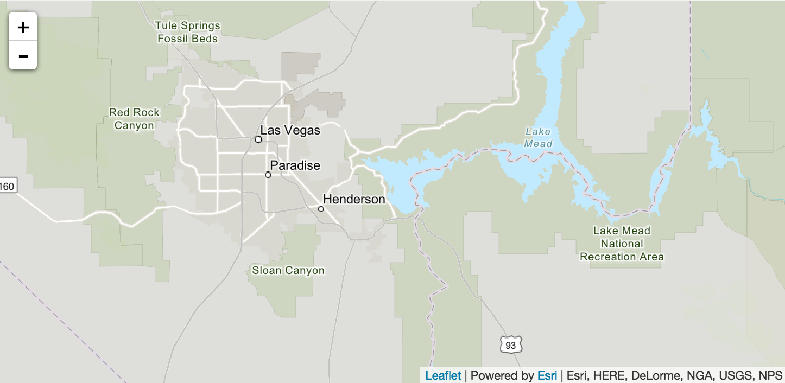

# Esri Leaflet Vector Tile Plugin

[![npm version][npm-img]][npm-url]
[](https://raw.githubusercontent.com/Esri/esri-leaflet-vector/master/LICENSE)

[npm-img]: https://img.shields.io/npm/v/esri-leaflet-vector.svg?style=flat-square
[npm-url]: https://www.npmjs.com/package/esri-leaflet-vector

> A plugin for Esri Leaflet to visualize Vector tiles from ArcGIS Online.

## Example

Take a look at the [live demo](http://esri.github.com/esri-leaflet/examples/vector-basemap.html).



```html
<!DOCTYPE html>
<html>
  <head>
    <meta charset="utf-8" />
    <title>Esri Leaflet Vector Basemap</title>
    <meta name="viewport" content="width=device-width, initial-scale=1" />

    <!-- Load Leaflet from CDN -->
    <link rel="stylesheet" href="https://unpkg.com/leaflet/dist/leaflet.css" />
    <script src="https://unpkg.com/leaflet/dist/leaflet.js"></script>

    <!-- Esri Leaflet and Esri Leaflet Vector -->
    <script src="https://unpkg.com/esri-leaflet/dist/esri-leaflet.js"></script>
    <script src="https://unpkg.com/esri-leaflet-vector@3/dist/esri-leaflet-vector.js"></script>

    <style>
      body {
        margin: 0;
        padding: 0;
      }

      #map {
        position: absolute;
        top: 0;
        bottom: 0;
        right: 0;
        left: 0;
      }
    </style>
  </head>

  <body>
    <div id="map"></div>

    <script>
      var map = L.map("map").setView([40.706, -73.926], 14);

      L.esri.Vector.vectorBasemapLayer("ArcGIS:Streets", {
        apikey: "< YOUR VALID API KEY HERE >",
      }).addTo(map);
    </script>
  </body>

</html>
```

## API Reference

### `L.esri.Vector.vectorBasemapLayer`

For rendering basemap layers which use the Esri Basemap Styles API internally. Extends [L.Layer](https://leafletjs.com/reference#layer).

```javascript
L.esri.Vector.vectorBasemapLayer("ArcGIS:Streets", {
  // provide either apikey or token
  apikey: "...",
  token: "...",
}).addTo(map);

L.esri.Vector.vectorBasemapLayer("ITEM_ID", {
  // provide either apikey or token
  apikey: "...",
  token: "...",
}).addTo(map);
```

#### Basemap Names

Please see [the documentation](http://esri.github.io/esri-leaflet/api-reference/layers/vector-basemap.html#vector-basemaps) for a list of basemap names you can use (`ArcGIS:Streets`, `ArcGIS:DarkGray`, `ArcGIS:Imagery:Standard`, `OSM:Standard`, etc).


### `L.esri.Vector.vectorTileLayer`

For custom vector tiles layers published from user data. Extends [L.Layer](https://leafletjs.com/reference#layer).

```javascript
L.esri.Vector.vectorTileLayer("ITEM_ID", {
  // provide either apikey or token if not public
  apikey: "...",
  token: "...",
  // optionally customize the style with a function that gets the default style from the service
  // and returns the new style to be used
  style: (style) => {
    return newStyle;
  }
}).addTo(map);

L.esri.Vector.vectorTileLayer("SERVICE_URL", {
  // provide either apikey or token if not public
  apikey: "...",
  token: "...",
  // optionally customize the style with a function that gets the default style from the service
  // and returns the new style to be used
  style: (style) => {
    return newStyle
  }
}).addTo(map);
```

## Development Instructions

### Quickstart Development Instructions

1. [Fork and clone this repo](https://help.github.com/articles/fork-a-repo).
2. `cd` into the `esri-leaflet-vector` folder.
3. Install the dependencies with `npm install`.
4. Run `npm run dev` to compile the raw source inside a newly created `dist` folder and start up a development web server.
   - Alternatively, run `npm run start` to compile raw source code into both "debug" and "production" versions. This process will take longer to compile when saving your local changes to source code. Recommended only when building for production.
5. Open `examples/quickstart-dev.html` to see local changes in action.

### Advanced Development Instructions

1. [Fork and clone this repo](https://help.github.com/articles/fork-a-repo).
2. `cd` into the `esri-leaflet-vector` folder.
3. Install the dependencies with `npm install`.
4. Run `npm run build` to compile the raw source inside a newly created `dist` folder.
5. Run `npm test` from the command line to execute tests.
6. Open `examples/quickstart-dev.html` or `examples/quickstart-prod.html` to see local changes in action.
7. Create a [pull request](https://help.github.com/articles/creating-a-pull-request) if you'd like to share your work.

## Dependencies

- Leaflet version [1.5.0](https://github.com/Leaflet/Leaflet/releases/tag/v1.5.0) (or higher) is required.
- Esri Leaflet [2.3.0](https://github.com/Esri/esri-leaflet/releases/tag/v2.3.0) (or higher) is required.
- [mapbox-gl-js](https://www.mapbox.com/mapbox-gl-js/)

## Resources

- [ArcGIS for Developers](http://developers.arcgis.com)
- [ArcGIS REST Services](http://resources.arcgis.com/en/help/arcgis-rest-api/)
- [@Esri](http://twitter.com/esri)

## Issues

Find a bug or want to request a new feature? Please let us know by submitting an [issue](https://github.com/Esri/esri-leaflet-vector/issues).

Please take a look at previous issues on [Esri Leaflet](https://github.com/Esri/esri-leaflet-vector/issues?labels=FAQ&milestone=&page=1&state=closed) and Esri Leaflet [Vector](https://github.com/Esri/esri-leaflet-vector/issues) that resolve common problems.

You can also post issues on the [GIS Stack Exchange](http://gis.stackexchange.com/questions/ask?tags=esri-leaflet,leaflet) an/or the [Esri Leaflet place](https://geonet.esri.com/discussion/create.jspa?sr=pmenu&containerID=1841&containerType=700&tags=esri-leaflet,leaflet) on GeoNet.

## Contributing

Esri welcomes contributions from anyone and everyone. Please see our [guidelines for contributing](https://github.com/Esri/esri-leaflet/blob/master/CONTRIBUTING.md).

## [Terms](https://github.com/Esri/esri-leaflet#terms)

## Licensing

Copyright &copy; 2016-2020 Esri

Licensed under the Apache License, Version 2.0 (the "License");
you may not use this file except in compliance with the License.
You may obtain a copy of the License at

> http://www.apache.org/licenses/LICENSE-2.0

Unless required by applicable law or agreed to in writing, software
distributed under the License is distributed on an "AS IS" BASIS,
WITHOUT WARRANTIES OR CONDITIONS OF ANY KIND, either express or implied.
See the License for the specific language governing permissions and
limitations under the License.

A copy of the license is available in the repository's [LICENSE](./LICENSE) file.
